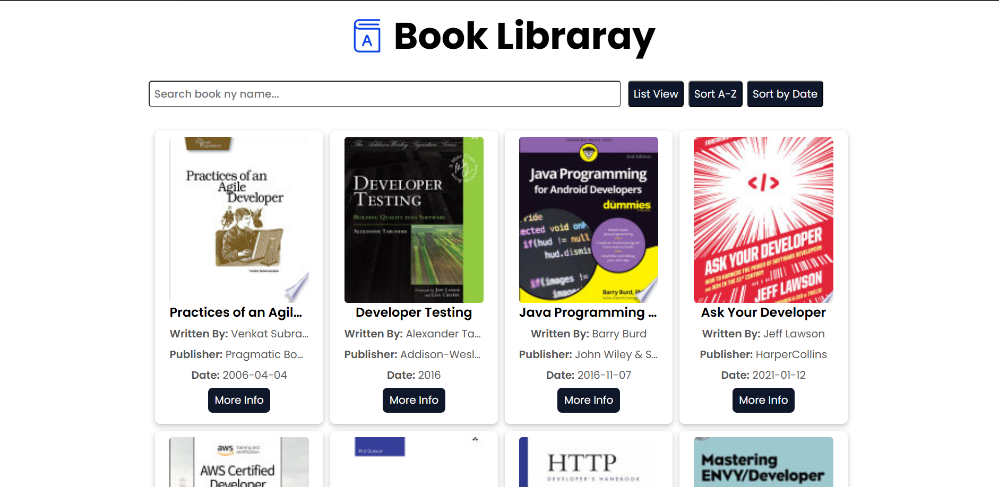
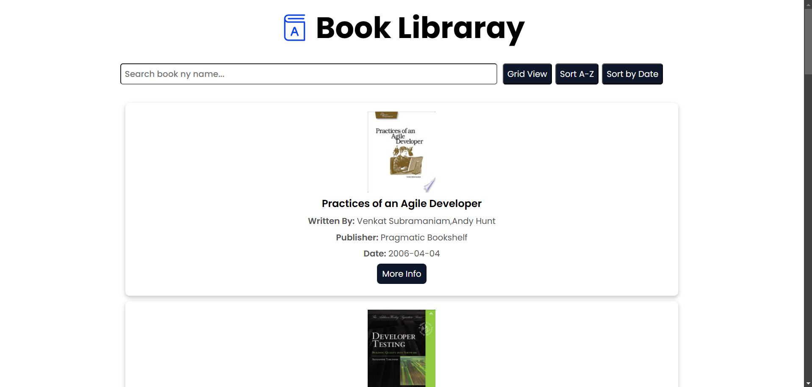

# 📚 Book Library Project

  

> A simple and interactive book library web application that allows users to browse books, search, sort, and toggle between grid and list views.

## ✨ Features

✔️ Fetches books dynamically from an API  
✔️ Search books by title  
✔️ Sort books alphabetically and by date  
✔️ Toggle between List View and Grid View  
✔️ Pagination for seamless browsing  
✔️ Hover effects and interactive UI animations

---

## 🚀 Live Demo

🔗 [View the Live Project](#) (Replace with your live link)

---

## 🛠️ Tech Stack

- HTML5
- CSS3 (Animations & Transitions)
- JavaScript (DOM Manipulation & Fetch API)

---

## 📂 Project Structure

```
📦 Book-Library
├── 📜 index.html       # Main HTML file
├── 🎨 style.css        # Styling with CSS
├── 🚀 app.js          # JavaScript for interactivity
├── 📂 assets/         # Images & Logos
└── 📜 README.md       # Project Documentation
```

---

## 📖 How to Use

1️⃣ Clone the repository:

```bash
git clone https://github.com/sanketsingh01/Masterji_Assignment4.git
```

2️⃣ Open the project folder:

```bash
cd Masterji_Assignment4
```

3️⃣ Open `index.html` in a browser.

---

## ⚡ Setup & Installation

No dependencies required! Just open `index.html` in your favorite browser, and you're good to go! 🚀

---

## 🎨 Screenshots

### 📌 Grid View



### 📌 List View

  
(Replace these placeholders with actual screenshots.)

---

## 💡 Future Enhancements

- [ ] Add book favorites feature 📌
- [ ] Implement dark mode 🌙
- [ ] Allow users to add custom books ✍️
- [ ] Offline book storage with localStorage 💾

---

## 🏆 Contributing

Contributions are welcome! Feel free to fork this repository and submit a pull request. 🙌

---

## 📄 License

This project is open-source and available under the [MIT License](LICENSE).

---

### 🎯 Happy Coding! 🚀
